## Hybrid Cloud Lab

## Guestbook Hybrid Deployment


December 2020

---


This example shows how to build a simple hybrid multi-tier web application using **OCP** and **IBM Cloud services.** 

The application consists of a **web front end**, Redis master for **storage**, and replicated set of Redis slaves, all for which we will create Kubernetes deployments, pods, and services and a **sentiment analyzer service** which is connected to **IBM Watson Tone Analyzer service** on IBM Cloud


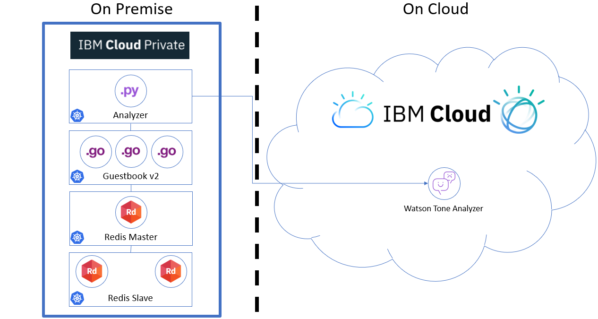


---

### Requirements

- In this lab, you need to have an **IBM Cloud account**

- Also install the IBM Cloud (**ibmcloud**) [command line interface](<https://cloud.ibm.com/docs/cli?topic=cli-getting-started>) to access IBM Cloud public from your laptop.

- This lab assumes also that you have **OpenShift installed** and configured.


# Task 1. IBM Cloud registration

**<u>Skip This task if you already have an IBM cloud account</u>** 

For the next exercice, you need to define a IBM free account:
- [ ] You should have **1 valid email** 

- [ ] Sign up to the **IBM Cloud** 


If you don't have a valid email address or if you don't want to use your personal or professional email address, please create an email account on GMAIL for instance. **Don't use any temporary email.**


### Sign in to IBM Cloud
If you don't have already registered to **IBM Cloud**,  
Open this link in your favorite internet browser.

<https://cloud.ibm.com/registration?target=https://cloud.ibm.com/docs>

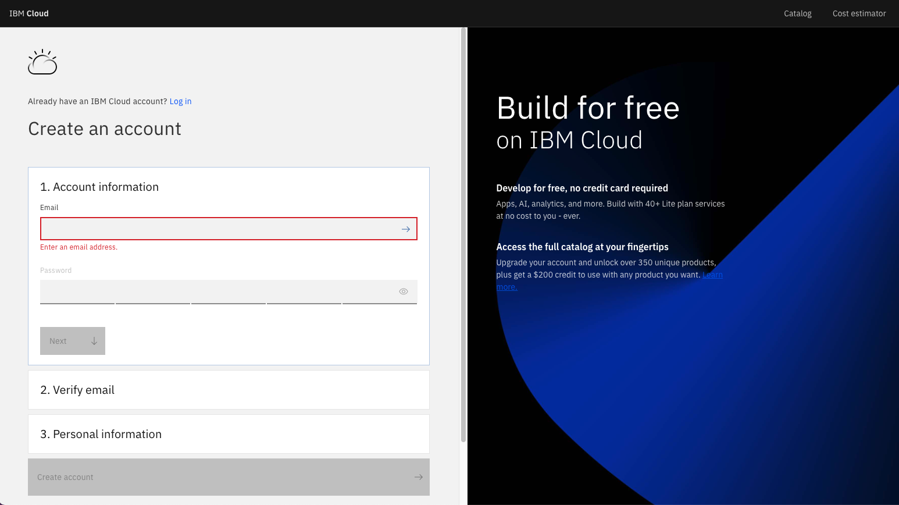

Enter your email address and password  and verify your email :

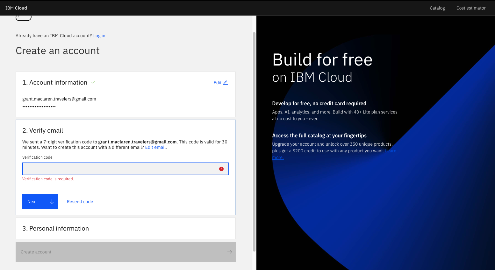

Check your inbox and type the code that you received to check the accound creation:

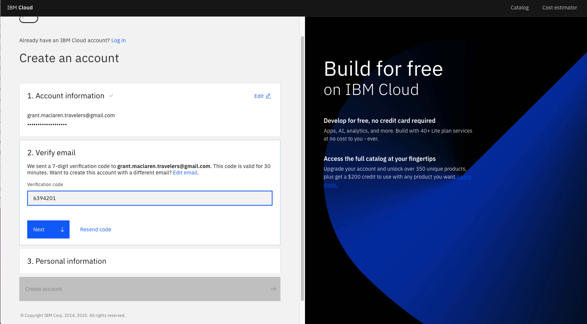

Enter personal information like first name and last name:

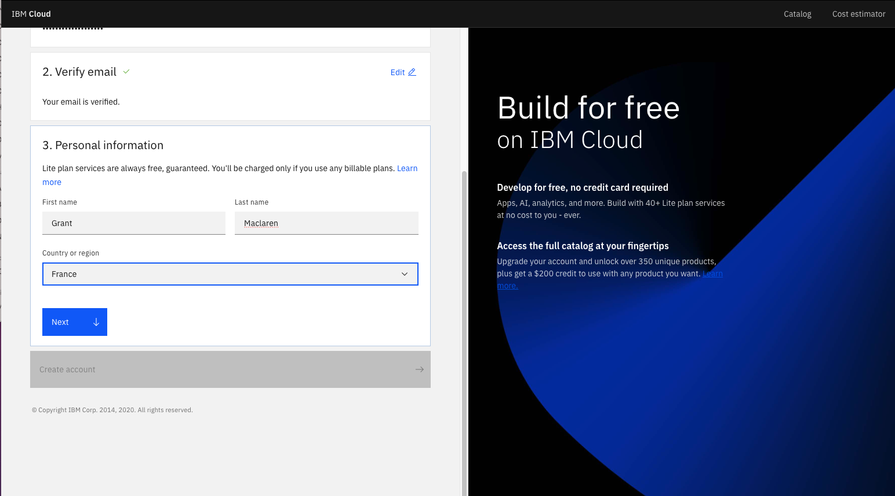

And then click on create an account: 

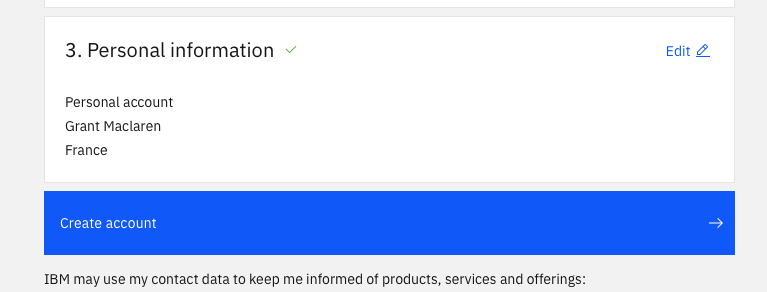


Then click on **Proceed**

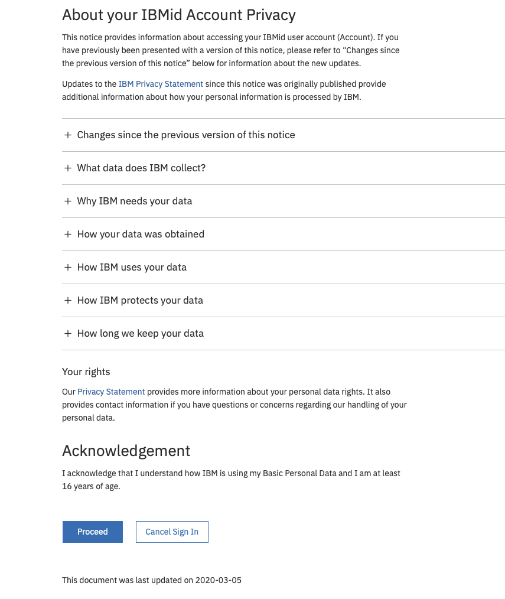

Login to IBM Cloud : 

``` http
https://cloud.ibm.com
```

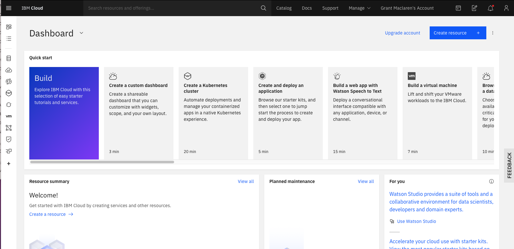


Check that you are the right person (click on the avatar on the top right part of the screen)

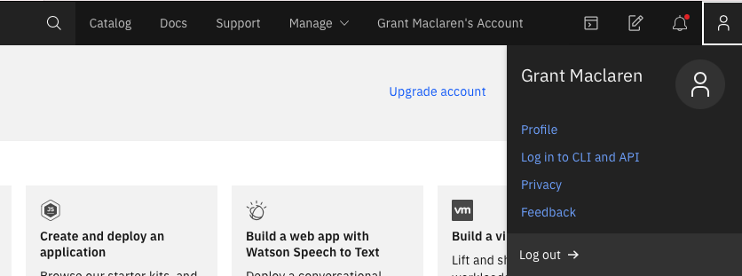


# Task 2. Install Git on your laptop

**<u>Skip This task if you already have git installed on your laptop</u>**


To install Git command line : 

On MacOS :
http://mac.github.com

On Windows: 
http://git-scm.com/download/win

At some point during the installation, change to the **"Use Windows default console"** and continue the installation.


# Task 3. Install the ibmcloud command

**<u>You must install the ibmcloud command on your laptop</u>**


The **ibmcloud** command line interface (CLI) provides a set of commands that are grouped by namespace for users to interact with IBM Cloud. In previous versions, the name of that command was "bluemix" or "bx".

Find more information here for more installation approaches :

<https://cloud.ibm.com/docs/cli/reference/ibmcloud?topic=cloud-cli-install-ibmcloud-cli#install_use>


**For MacOS :**

https://clis.cloud.ibm.com/download/bluemix-cli/latest/osx


**For Linux :**

`curl -fsSL https://clis.cloud.ibm.com/install/linux | sh`


**For Windows :**

https://clis.cloud.ibm.com/download/bluemix-cli/latest/win64


Then test your command (open a terminal or a command line) :	

` ibmcloud`

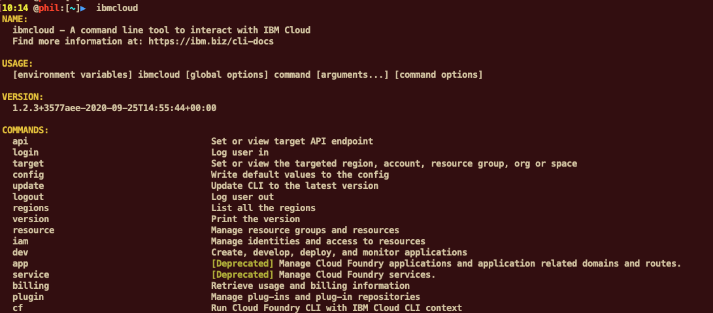


# Task 4. Login to IBM Cloud

Login to IBM Cloud with the ibmcloud command :

 `ibmcloud login -a cloud.ibm.com -r eu-gb`

 And answer a few questions: email, password :

```bash
# ibmcloud login -a cloud.ibm.com -r eu-gb
API endpoint: https://cloud.ibm.com

Email> grant.maclaren.travelers@gmail.com

Password> 
Authenticating...
OK

Targeted account Grant Maclaren's Account (71b4a4744876452c92d3b8a92c98ccc8)

Targeted region eu-gb

                      
API endpoint:      https://cloud.ibm.com   
Region:            eu-gb   
User:              grant.maclaren.travelers@gmail.com   
Account:           Grant Maclaren's Account (71b4a4744876452c92d3b8a92c98ccc8)   
Resource group:    No resource group targeted, use 'ibmcloud target -g RESOURCE_GROUP'   
CF API endpoint:      
Org:                  
Space:                
#
```


#  Task 5. Login to OpenShift

First run the following command to connect to your OpenShift instance (see in previous lab how to get access to OpenShift) :

```
oc login --token=<token> --server=<server>
```

Go to you project:

```
oc project labproj<xx>
```

```
oc status
```

Be sure that you are on project labproj<xx> which match to your number. 


Go to a temp **directory** (or create one if necessary)

```bash
cd temp
```


Then **Clone** the following git repo : 

```bash
git clone https://github.com/phthom/pht-guestbook.git
```


Go to that directory:

```
cd pht-guestbook
```

List the directory

```bash
# ls
total 176
drwxr-xr-x   15 phil  staff    480 Apr 16 22:45 .
drwx------  119 phil  staff   3808 Apr 16 22:45 ..
drwxr-xr-x   13 phil  staff    416 Apr 16 22:45 .git
-rw-r--r--    1 phil  staff  13056 Apr 16 22:45 README.md
drwxr-xr-x    5 phil  staff    160 Apr 16 22:45 analyzer
-rw-r--r--    1 phil  staff   1096 Apr 16 22:45 analyzer-deployment.yaml
-rw-r--r--    1 phil  staff    435 Apr 16 22:45 analyzer-service.yaml
drwxr-xr-x    7 phil  staff    224 Apr 16 22:45 guestbook
-rw-r--r--    1 phil  staff    512 Apr 16 22:45 guestbook-deployment.yaml
-rw-r--r--    1 phil  staff  40028 Apr 16 22:45 guestbook-page.png
-rw-r--r--    1 phil  staff    436 Apr 16 22:45 guestbook-service.yaml
-rw-r--r--    1 phil  staff    432 Apr 16 22:45 redis-master-deployment.yaml
-rw-r--r--    1 phil  staff    205 Apr 16 22:45 redis-master-service.yaml
-rw-r--r--    1 phil  staff    446 Apr 16 22:45 redis-slave-deployment.yaml
-rw-r--r--    1 phil  staff    202 Apr 16 22:45 redis-slave-service.yaml
```


# Task 6. Redis master pod


###  Create the Redis master pod

Use the `redis-master-deployment.yaml` file to create a [deployment](https://kubernetes.io/docs/concepts/workloads/controllers/deployment/) and Redis master [pod](https://kubernetes.io/docs/concepts/workloads/pods/pod-overview/). The pod runs a Redis key-value server in a container. Using a deployment controller is the preferred way to launch long-running pods, even for 1 replica, so that the pod benefits from the self-healing mechanism in Kubernetes (keeps the pods alive).

1. Use the [redis-master-deployment.yaml](redis-master-deployment.yaml) file to create the Redis master deployment in your Kubernetes cluster by running the command:

    ```bash
    oc apply -f redis-master-deployment.yaml
    ```

    Results

    ```bash
    root@iccws101:~/pht-guestbook# oc apply -f redis-master-deployment.yaml
    deployment.apps/redis-master created
    ```

2. To verify that the redis-master controller is up, list the deployments you created in the cluster with the command:

    ```bash
    oc get deployment
    ```

    Results:

    ```bash
    root@iccws101:~/pht-guestbook# oc get deployment
    NAME           READY   UP-TO-DATE   AVAILABLE   AGE
    redis-master   1/1     1            1           6m29s
    ```

    Result: The delpoyment then creates the single Redis master pod.

3. To verify that the redis-master pod is running, list the pods you created in cluster with the command:

    ```bash
    oc get pods
    ```

    Results:

    ```bash
    root@iccws101:~/pht-guestbook# oc get pods
    NAME                            READY   STATUS    RESTARTS   AGE
    redis-master-7b5cc58fc8-x6m2b   1/1     Running   0          54m
    ...
    ```

    Result: You'll see a single Redis master pod and the machine where the pod is running after the pod gets placed (may take up to thirty seconds).


### Create the Redis master service

A Kubernetes [service](https://kubernetes.io/docs/concepts/services-networking/service/) is a named load balancer that proxies traffic to one or more pods. The services in a Kubernetes cluster are discoverable inside other pods via environment variables or DNS.

Services find the pods to load balance based on pod labels. The pod that you created in previous step has the label `app=redis` and `role=master`. The selector field of the service determines which pods will receive the traffic sent to the service.

1. Use the [redis-master-service.yaml](redis-master-service.yaml) file to create the service in your Kubernetes cluster by running the command:

    ```bash
    oc apply -f redis-master-service.yaml
    ```

    Results:

    ```bash
    root@iccws101:~/pht-guestbook# oc apply -f redis-master-service.yaml
    service/redis-master created
    ```

2. To verify that the redis-master service is up, list the services you created in the cluster with the command:

    ```bash
    oc get services
    ```

    Results:

    ```bash
    root@iccws101:~/pht-guestbook# oc get services
    NAME           TYPE        CLUSTER-IP    EXTERNAL-IP   PORT(S)    AGE
    redis-master   ClusterIP   10.0.14.216   <none>        6379/TCP   99s
    
    ```

    Result: All new pods will see the `redis-master` service running on the host (`$REDIS_MASTER_SERVICE_HOST` environment variable) at port `6379`, or running on `redis-master:6379`. After the service is created, the service proxy on each node is configured to set up a proxy on the specified port (in our example, that's port `6379`).


#  Task 7. Redis slave pods

### Create the Redis slave pods

The Redis master we created earlier is a single pod (REPLICAS = 1), while the Redis read slaves we are creating here are 'replicated' pods. In Kubernetes, a deployment is responsible for managing the multiple instances of a replicated pod.

1. Use the file [redis-slave-deployment.yaml](redis-slave-deployment.yaml) to create the deployment by running the command:

    ```bash
    oc apply -f redis-slave-deployment.yaml
    ```

    Results:

    ```bash
    root@iccws101:~/pht-guestbook# oc apply -f redis-slave-deployment.yaml
    deployment.apps/redis-slave created
    ```

2. To verify that the redis-slave deployment is running, run the `kubectl get deployment` command:

    ```bash
    oc get deployment
    ```

    Results:

```bash
root@iccws101:~/pht-guestbook#  oc get deployment
NAME           READY   UP-TO-DATE   AVAILABLE   AGE
redis-master   1/1     1            1           12m
redis-slave    2/2     2            2           20s

```

Result: The deployment creates and configures the Redis slave pods through the redis-master service (name:port pair, in our example that's `redis-master:6379`).

Example:
The Redis slaves get started by the deployment with the following command:

```console
redis-server --slaveof redis-master 6379
```

4. To verify that the Redis master and slaves pods are running, run the `oc get pods` command:

   ```bash
   oc get pods
   ```

   Results:

```bash
root@iccws101:~/pht-guestbook# oc get pods
NAME                            READY   STATUS    RESTARTS   AGE
redis-master-7b5cc58fc8-phhdh   1/1     Running   0          21m
redis-slave-5db5dcfdfd-2mx4j    1/1     Running   0          5m48s
redis-slave-5db5dcfdfd-q6gfz    1/1     Running   0          5m48s

```

Result: You see the single Redis master and two Redis slave pods.


### Create the Redis slave service

Just like the master, we want to have a service to proxy connections to the read slaves. In this case, in addition to discovery, the Redis slave service provides transparent load balancing to clients.

1. Use the [redis-slave-service.yaml](redis-slave-service.yaml) file to create the Redis slave service by running the  command:

    ```bash
    oc create -f redis-slave-service.yaml
    ```

    Results:

    ```bash
    root@iccws101:~/pht-guestbook# oc create -f redis-slave-service.yaml
    service/redis-slave created
    ```

2. To verify that the redis-slave service is up, list the services you created in the cluster with the `kubectl get services` command:

    ```bash
    root@iccws101:~/pht-guestbook# oc get services
    NAME           TYPE        CLUSTER-IP     EXTERNAL-IP   PORT(S)    AGE
    redis-master   ClusterIP   10.0.14.216    <none>        6379/TCP   24m
    redis-slave    ClusterIP   10.0.186.203   <none>        6379/TCP   42s
    ```

    Result: The service is created with labels `app=redis` and `role=slave` to identify that the pods are running the Redis slaves.

Tip: It is helpful to set labels on your services themselves--as we've done here--to make it easy to locate them later.


# Task 8. Redis guestbook pods

### Create the guestbook pods

This is a simple Go `net/http` ([negroni](https://github.com/codegangsta/negroni) based) server that is configured to talk to either the slave or master services depending on whether the request is a read or a write. The pods we are creating expose a simple JSON interface and serves a jQuery-Ajax based UI. Like the Redis slaves, these pods are also managed by a deployment.

1. Use the [guestbook-deployment.yaml](guestbook-deployment.yaml) file to create the guestbook deployment by running the command:

    ```bash
    oc apply -f guestbook-deployment.yaml
    ```

    Results:

    ```bash
    root@iccws101:~/pht-guestbook# oc apply -f guestbook-deployment.yaml
    deployment.apps/guestbook-v2 created
    ```

 Tip: If you want to modify the guestbook code it can be found in the `guestbook` directory, along with its Makefile. If you have pushed your custom image be sure to update the `image` property accordingly in the guestbook-deployment.yaml.

2. To verify that the guestbook deployment is running, run the command:

    ```bash
    oc get deployment
    ```

    Results:

    ```bash
    root@iccws101:~/pht-guestbook# oc get deployment
    NAME           READY   UP-TO-DATE   AVAILABLE   AGE
    guestbook-v2   3/3     3            3           41s
    redis-master   1/1     1            1           178m
    redis-slave    2/2     2            2           166m
    ```

3. To verify that the guestbook pods are running (it might take up to thirty seconds to create the pods), list the pods you created in cluster with the command:

    ```bash
    kubectl get pods
    ```

    Results:

    ```bash
    root@iccws101:~/pht-guestbook# oc get pods
    NAME                            READY   STATUS    RESTARTS   AGE
    guestbook-v2-96f8b7fb8-5rfpw    1/1     Running   0          105s
    guestbook-v2-96f8b7fb8-srcrx    1/1     Running   0          105s
    guestbook-v2-96f8b7fb8-zlt84    1/1     Running   0          105s
    redis-master-7b5cc58fc8-phhdh   1/1     Running   0          103m
    redis-slave-5db5dcfdfd-2mx4j    1/1     Running   0          87m
    redis-slave-5db5dcfdfd-q6gfz    1/1     Running   0          87m
    
    ```

    Result: You see a single Redis master, two Redis slaves, and three guestbook pods.


### Create the guestbook service

Just like the others, we create a service to group the guestbook pods but this time, to make the guestbook front end externally visible, we specify `"type": "NodePort"`.

1. Use the [guestbook-service.yaml](guestbook-service.yaml) file to create the guestbook service by running the command:

    ```bash
    oc apply -f guestbook-service.yaml
    ```

    Results:

    ```bash
    root@iccws101:~/pht-guestbook# oc apply -f guestbook-service.yaml
    service/guestbook created
    ```

2. To verify that the guestbook service is up, list the services you created in the cluster with the  command:

    ```bash
     oc get services
    ```

    Results:

    ```bash
    root@iccws101:~/pht-guestbook#  oc get services
    NAME           TYPE        CLUSTER-IP       EXTERNAL-IP   PORT(S)        AGE
    guestbook      NodePort    172.21.168.165   <none>        80:30189/TCP   25m
    redis-master   ClusterIP   172.21.32.160    <none>        6379/TCP       3h17m
    redis-slave    ClusterIP   172.21.197.191   <none>        6379/TCP       3h12m
    ```

    Result: The service is created with label `app=guestbook`.


# Task 9. Watson Tone Analyser

### Create Watson Tone Analyzer on IBM Cloud

Watson Tone Analyzer detects the tone from the words that users enter into the Guestbook app. The tone is converted to the corresponding emoticons.


1. Log in to the IBM Cloud CLI  using your own IBM ID:

   ```
   ibmcloud login -a cloud.ibm.com -r eu-gb
   ibmcloud target -g Default
   ```


  ```bash
# ibmcloud login
API endpoint: https://cloud.ibm.com
Region: eu-gb

Email> tufih@mailfavorite.com

Password>
Authenticating...
OK

Targeted account ICCWS ICCWS's Account (95f04fe00e284449bd3990ee72688be3)

Targeted resource group Default


API endpoint:      https://cloud.ibm.com
Region:            eu-gb
User:              tufih@mailfavorite.com
Account:           ICCWS ICCWS's Account (95f04fe00e284449bd3990ee72688be3)
Resource group:    Default
CF API endpoint:
Org:
Space:

Tip: If you are managing Cloud Foundry applications and services
- Use 'ibmcloud target --cf' to target Cloud Foundry org/space interactively, or use 'ibmcloud target --cf-api ENDPOINT -o ORG -s SPACE' to target the org/space.
- Use 'ibmcloud cf' if you want to run the Cloud Foundry CLI with current IBM Cloud CLI context.

  ```

3. Create Watson Tone Analyzer in your account.

   Type the following command to create a **watson tone Analyser** on IBM Cloud :

   ```bash
   ibmcloud resource service-instance-create my-tone-analyzer-service tone-analyzer lite us-south
   ```


  ```bash
root@iccws101:~/pht-guestbook# ibmcloud resource service-instance-create my-tone-analyzer-service tone-analyzer lite us-south
Creating service instance my-tone-analyzer-service in resource group Default of account Grant Maclaren's Account as grant.maclaren.travelers@gmail.com...
OK
Service instance my-tone-analyzer-service was created.
                     
Name:             my-tone-analyzer-service   
ID:               crn:v1:bluemix:public:tone-analyzer:us-south:a/71b4a4744876452c92d3b8a92c98ccc8:13b3707d-7651-4d14-b837-69dbea54de48::   
GUID:             13b3707d-7651-4d14-b837-69dbea54de48   
Location:         us-south   
State:            active   
Type:             service_instance   
Sub Type:            
Allow Cleanup:    false   
Locked:           false   
Created at:       2020-12-08T13:24:05Z   
Updated at:       2020-12-08T13:24:05Z   
Last Operation:                   
                  Status    create succeeded      
                  Message   Completed create instance operation   
  ```


4. Create the service key for the Tone Analyzer service. 

   This command should output the credentials you just created. You will need the value for **apikey** & **url** later. 

```
ibmcloud resource service-key-create tone-analyzer-key Manager --instance-name my-tone-analyzer-service
```

Results:

```bash
root@iccws101:~/pht-guestbook#  ibmcloud resource service-key-create tone-analyzer-key Manager --instance-name my-tone-analyzer-service
Creating service key of service instance my-tone-analyzer-service under account Grant Maclaren's Account as grant.maclaren.travelers@gmail.com...
OK
Service key crn:v1:bluemix:public:tone-analyzer:us-south:a/71b4a4744876452c92d3b8a92c98ccc8:13b3707d-7651-4d14-b837-69dbea54de48:resource-key:a1f9a81e-ed7c-4397-bb07-55ad636e9237 was created.
                  
Name:          tone-analyzer-key   
ID:            crn:v1:bluemix:public:tone-analyzer:us-south:a/71b4a4744876452c92d3b8a92c98ccc8:13b3707d-7651-4d14-b837-69dbea54de48:resource-key:a1f9a81e-ed7c-4397-bb07-55ad636e9237   
Created At:    Tue Dec  8 13:27:36 UTC 2020   
State:         active   
Credentials:                                   
               apikey:                   X7kXzf4Hv3X3Ky1iIyOILUvFiERnfJrs-TwP-KBzrGOj      
               iam_apikey_description:   Auto-generated for key a1f9a81e-ed7c-4397-bb07-55ad636e9237      
               iam_apikey_name:          tone-analyzer-key      
               iam_role_crn:             crn:v1:bluemix:public:iam::::serviceRole:Manager      
               iam_serviceid_crn:        crn:v1:bluemix:public:iam-identity::a/71b4a4744876452c92d3b8a92c98ccc8::serviceid:ServiceId-b039793a-f406-44e8-a7eb-6c1063330209      
               url:                      https://api.us-south.tone-analyzer.watson.cloud.ibm.com/instances/13b3707d-7651-4d14-b837-69dbea54de48    
```
5. if you need to get the service-keys later, you can use the following command:

      ibmcloud resource service-key tone-analyzer-key


      > Take a note of : 
    
      - apikey:                   X7kXzf4Hv3X3Ky1iIyOILUvFiERnfJrs-TwP-KBzrGOj
      - **url:**                      **https://api.us-south.tone-analyzer.watson.cloud.ibm.com/instances/13b3707d-7651-4d14-b837-69dbea54de48**


### Manage connection to IBM Cloud configuration 

To externalize the configuration of the remote service, we will use 2 Kubernetes resources : **Secrets** (to manage passwords and keys) and **ConfigMaps** (to manager environment configuration). 

1. Create Secret containing API Key (replace YOUR_APIKEY with your api key from previous step. Keep the quotes around the key)

   `echo -n 'YOUR_APIKEY' > ./wta-apikey`

   `oc create secret generic wta-apikey-secret --from-file=./wta-apikey`

2. Create ConfigMap containing Environment variable. Create ibmcloud.env file containing the environment variable to access Watson Tone Analyzer service.

    `nano ibmcloud.env`

```bash
VCAP_SERVICES_TONE_ANALYZER_TOKEN_ADDRESS=https://iam.bluemix.net/identity/token
VCAP_SERVICES_TONE_ANALYZER_SERVICE_API=YOUR_URL
```

​		Hit `CTRL-O`, `Enter`, `CTRL-X ` to save the file.

​	Then create the config map using the following command :

​	`oc create configmap env-ibmcloud-configmap --from-env-file=ibmcloud.env`

  ```
root@iccws101:~/pht-guestbook# kubectl create configmap env-ibmcloud-configmap --from-env-file=ibmcloud.env
configmap/env-ibmcloud-configmap created
  ```
3. Go inOpenShift  console to see the Secrets and ConfigMaps that has been created

     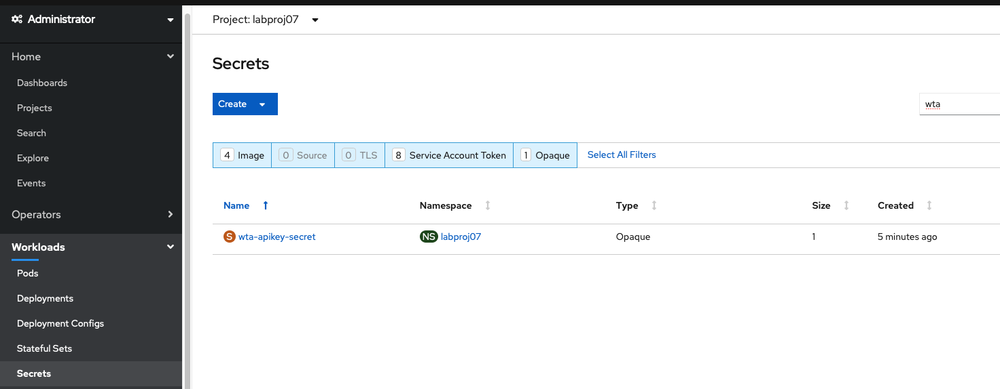

And the configmap:

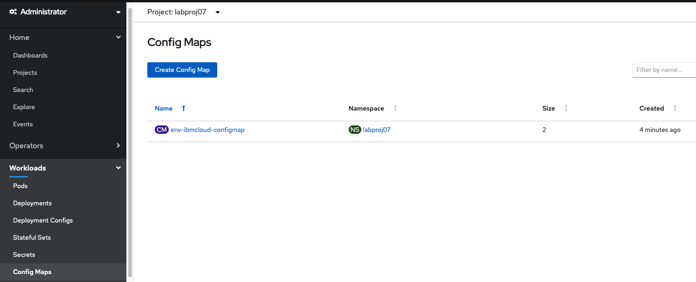


4. Deploy the analyzer application to OpenShift Cluster

- Open the `analyzer-deployment.yaml` and have a look at the  env section of the file :

```yaml
apiVersion: apps/v1
kind: Deployment
metadata:
  name: analyzer
  labels:
    app: analyzer
spec:
  selector:
    matchLabels:
      app: analyzer
  replicas: 1
  template:
    metadata:
      labels:
        app: analyzer
    spec:
      containers:
      - name: analyzer
        image: ibmcom/analyzer:v1.1
        imagePullPolicy: Always
        resources:
          requests:
            cpu: 100m
            memory: 100Mi
        env:
        - name: VCAP_SERVICES_TONE_ANALYZER_API_KEY
          valueFrom:
            secretKeyRef:
              name: wta-apikey-secret
              key: wta-apikey
        - name : VCAP_SERVICES_TONE_ANALYZER_TOKEN_ADDRESS
          valueFrom:
            configMapKeyRef:
              name: env-ibmcloud-configmap
              key: VCAP_SERVICES_TONE_ANALYZER_TOKEN_ADDRESS
        - name: VCAP_SERVICES_TONE_ANALYZER_SERVICE_API
          valueFrom:
            configMapKeyRef:
              name: env-ibmcloud-configmap
              key: VCAP_SERVICES_TONE_ANALYZER_SERVICE_API
        ports:
        - containerPort: 5000
          name: http
```

> **Don't change the file**


- Deploy the analyzer pods using the `analyzer-deployment.yaml`  : 

  ```bash
  oc apply -f analyzer-deployment.yaml
  ```

  Results:

```bash
 root@iccws101:~/pht-guestbook# oc apply -f analyzer-deployment.yaml
 deployment.apps/analyzer created
```

- Deploy the analyzer service using the `analyzer-service.yaml`  : 

  ```bash
  oc apply -f analyzer-service.yaml
  ```

  Results:

```bash
 root@iccws101:~/pht-guestbook# oc apply -f analyzer-service.yaml
service/analyzer created
```


Check the environment variables have been set : 

- Retrieve Analyzer pod ID (here analyzer-58644696f7-8tzsj) : 

```
root@iccws101:~/pht-guestbook# oc get pods | grep analyzer
analyzer-58644696f7-8tzsj       1/1     Running   0          24s
```

- Enter the POD in interactive mode (use your own pod id) :

```bash
root@iccws101:~/pht-guestbook# oc exec -it analyzer-58644696f7-8tzsj /bin/bash
root@analyzer-58644696f7-8tzsj:/#
```

- Look at environment variables : 

```bash
root@analyzer-58644696f7-8tzsj:/# env | grep TONE_ANALYZER
VCAP_SERVICES_TONE_ANALYZER_TOKEN_ADDRESS=https://iam.bluemix.net/identity/token
VCAP_SERVICES_TONE_ANALYZER_API_KEY=xxxxxxxxxxxxxxxxxxxxxxxxxxxxxxxxxxxxxxxxxxxxx
VCAP_SERVICES_TONE_ANALYZER_SERVICE_API=https://gateway.watsonplatform.net/tone-analyzer/api
```

- Exit the pod shell (using `exit`)


#  Task 10. Access the guestbook

You can now play with the guestbook that you just created by opening it in a browser.

1. Open OpenShift Console

2. Open Deployments : 

   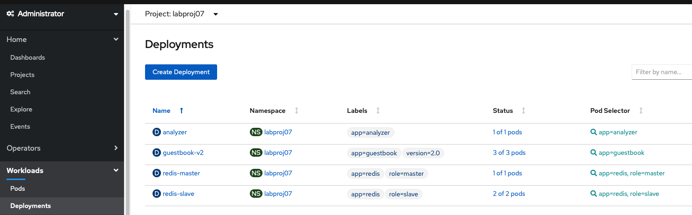

   Open services (in Networking left tab) and click on guestbook

   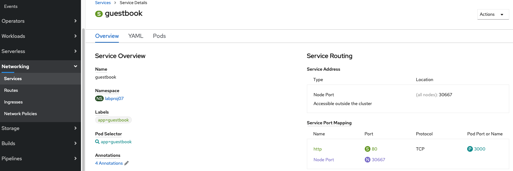

3. Create a route to access that application:

   ``` bash
   # oc expose svc/guestbook
   route.route.openshift.io/guestbook exposed
   ```

   And get the route URL

   ```bash
   # oc get route
   NAME        HOST/PORT                                                                                              PATH      SERVICES    PORT      TERMINATION   WILDCARD
   guestbook   guestbook-labproj07.niceam-ba36b2ed0b6b09dbc627b56ceec2f2a4-0000.us-south.containers.appdomain.cloud             guestbook   http                    None
   ```

4. In our example :  

   ```http
   http://guestbook-labproj07.niceam-ba36b2ed0b6b09dbc627b56ceec2f2a4-0000.us-south.containers.appdomain.cloud
   ```

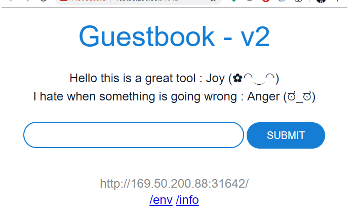


#  Congratulations : 

The guestbook displays in your browser.

Your hybrid guestbook application is up and running, accessing **Watson Tone Analyzer on IBM Cloud**.


#  Cleanup

After you're done playing with the guestbook, you can cleanup by deleting the guestbook service and removing the associated resources that were created.

Delete all the resources by running the following `kubectl delete -f .` command:

```console
root@iccws101:~/pht-guestbook# oc delete -f .
deployment.apps "analyzer" deleted
service "analyzer" deleted
deployment.apps "guestbook-v2" deleted
imagepolicy.securityenforcement.admission.cloud.ibm.com "guestbookimagepolicy" deleted
service "guestbook" deleted
deployment.apps "redis-master" deleted
service "redis-master" deleted
deployment.apps "redis-slave" deleted
service "redis-slave" deleted
```


